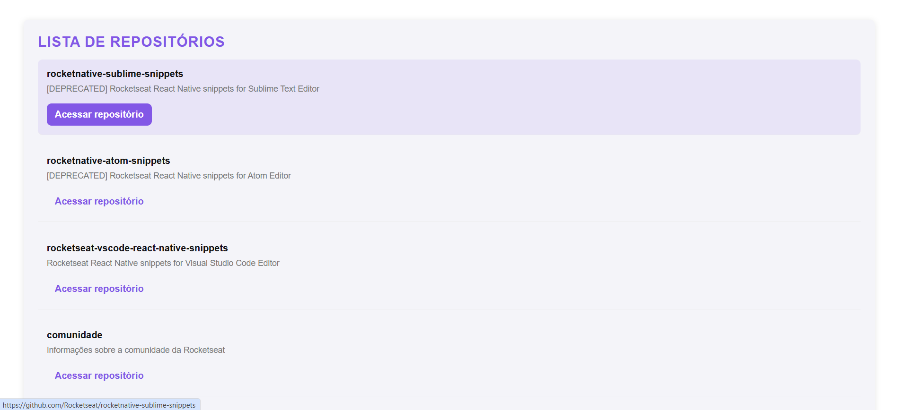

<h1 align="center">
  
</h1>

<h3 align="center">
  Github Explorer
</h3>

<p align="center">Criação de uma simples aplicação para explorar repositórios do Github utilizando o ReactJS</p>

<p align="center">
  <a href="#como-executar-o-projeto">Como executar o projeto</a>&nbsp;&nbsp;&nbsp;|&nbsp;&nbsp;&nbsp;
  <a href="#anotações">Anotações</a>
</p>

<p align="center">Front-end</p>

<p align="center">
  
</p>

## Como executar o projeto

### Clonar este repositório

```bash
git clone https://github.com/eliasmcastro/rocketseat-ignite-reactjs-github-explorer.git
```

### Requisitos

- [Node.js](https://nodejs.org) na versão 20.16.0
- [Yarn](https://yarnpkg.com) na versão 1.22.5

### Passos para a execução

**1. Executar aplicação**

Instalar as dependências do projeto

```bash
yarn
```

Iniciar a aplicação

```bash
yarn dev
```

A aplicação começará a ser executada em http://localhost:8080

## Anotações

### Configurando estrutura

- `yarn init -y` cria o arquivo package.json
- `yarn add react` para instalar o ReactJS
- `yarn add react-dom` para instalar o ReactDOM, ele é um pacote que permite que o React interaja com o DOM

### Configurando Babel

- O Babel é uma ferramenta de transpilação — ou seja, ela converte código escrito em uma versão mais recente do JavaScript (como ES6, ES7, etc.) para uma versão mais antiga e amplamente compatível com a maioria dos navegadores
- `yarn add @babel/core @babel/cli -D` para instalar o babel/core (o pacote principal do Babel) e babel/cli (permite que você use o Babel diretamente da linha de comando)
- `yarn add @babel/preset-env @babel/preset-react -D` para instalar o babel/preset-env (permite que você use recursos mais recentes do JavaScript sem se preocupar com a compatibilidade de navegadores) e preset-react (adiciona o suporte a JSX (uma sintaxe usada pelo React) e transforma o JSX em JavaScript que os navegadores podem entender)
- `yarn add babel-loader -D` para instalar o babel-loader (integração entre o babel e o webpack)

### Configurando Webpack

- O Webpack é uma ferramenta de empacotamento de módulos e ele tem como principal objetivo pegar diferentes arquivos de recursos (como JavaScript, CSS, imagens, fontes, etc.) e empacotá-los em um ou mais arquivos de saída (bundles), para que possam ser carregados de maneira eficiente pelo navegador.
- `yarn add webpack webpack-cli -D` para instalar o webpack (principal ferramenta usada para empacotar e otimizar módulos em uma aplicação JavaScript) e webpack-cli (interface de linha de comando do Webpack)
- `yarn add html-webpack-plugin -D` para instalar o html-webpack-plugin (facilita a criação de arquivos HTML em projetos que usam Webpack)
- `yarn webpack` para executar o Webpack
- `yarn add webpack-dev-server -D` para instalar o webpack-dev-server (servidor de desenvolvimento que oferece uma maneira fácil de executar sua aplicação localmente)
- `yarn webpack serve` para iniciar o Webpack Dev Server, que fará a aplicação rodar em `http://localhost:8080`

### Variáveis de Ambiente

- `yarn add cross-env -D` para instalar o cross-env (permite que você defina variáveis de ambiente)

### CSS

- `yarn add style-loader css-loader -D` para instalar o style-loader (responsável por injetar o conteúdo do arquivo CSS dentro do HTML da aplicação) e css-loader (interpreta e processa arquivos CSS, resolvendo dependências dentro deles)
- `yarn add node-sass -D` para instalar o node-sass (compila arquivos SASS/SCSS em CSS)
- `yarn add sass-loader -D` para instalar o sass-loader (integra o processo de compilação de arquivos SASS/SCSS ao Webpack, usando o node-sass para gerar o CSS)

### React Refresh Webpack Plugin

- `yarn add @pmmmwh/react-refresh-webpack-plugin react-refresh -D` para instalar o react-refresh-webpack-plugin (integra o React Refresh ao Webpack) e react-refresh (permite que o React faça substituições "quentes" de componentes sem perder o estado da aplicação)

### TypeScript

- `yarn add typescript -D` para instalar o typescript
- `yarn tsc --init` cria o arquivo de configuração do TypeScript

  ```json
  "compilerOptions": {
    "lib": ["DOM", "DOM.Iterable", "ESNext"],
    "allowJs": true,
    "jsx": "react-jsx",
    "noEmit": true,
    "strict": true,
    "moduleResolution": "node",
    "resolveJsonModule": true,
    "isolatedModules": true,
    "allowSyntheticDefaultImports": true,
    "esModuleInterop": true,
    "skipLibCheck": true,
    "forceConsistentCasingInFileNames": true
  },
  "include": ["src"]
  ```

- `yarn add @babel/preset-typescript -D` para instalar o preset-typescript (permite que você use TypeScript em seu projeto)
- `yarn add @types/react-dom -D` para instalar a definição de tipo da biblioteca react-dom

### Utilizando React DevTools

- O React DevTools é uma ferramenta de depuração (debugging) disponível como extensão para os navegadores Google Chrome e Mozilla Firefox